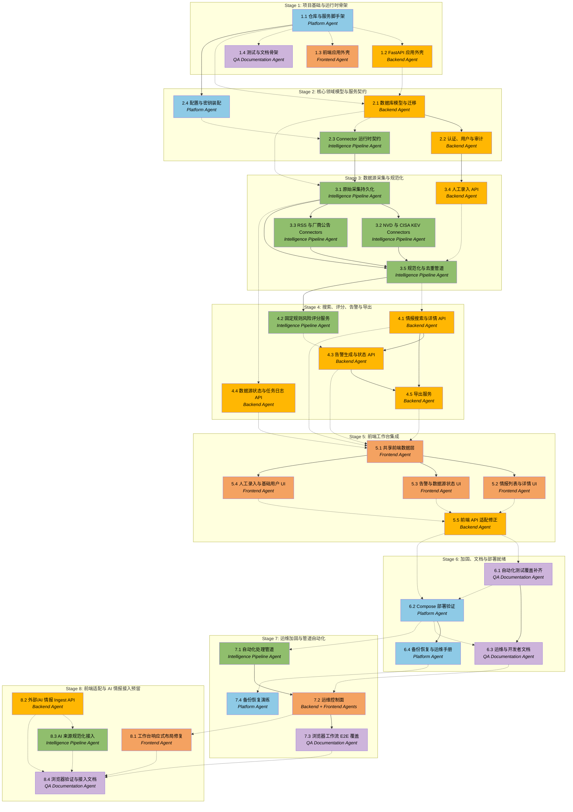

# APM 执行计划

## Workers

| Worker | 领域 | 职责说明 |
| --- | --- | --- |
| Platform Agent | 运行平台 | 项目脚手架、Docker Compose、配置、迁移、服务装配、部署运行时和运维脚本。 |
| Backend Agent | 后端 API | FastAPI 应用、认证、用户、领域 API、审计日志、导出能力和 API 集成面。 |
| Intelligence Pipeline Agent | 采集与处理 | Source Connector 框架、定时任务、Worker、原始采集、规范化、去重、评分和告警生成。 |
| Frontend Agent | 前端工作台 | 中文 Next.js/React 安全运营 UI、页面流程、API 集成和前端可用性验证。 |
| QA Documentation Agent | 质量与文档 | 测试策略、跨服务验证、部署检查，以及开发者/运维文档。 |

## Stages

| Stage | 名称 | 任务数 | Agents |
| --- | --- | --- | --- |
| 1 | 项目基础与运行时骨架 | 4 | Platform Agent, Backend Agent, Frontend Agent, QA Documentation Agent |
| 2 | 核心领域模型与服务契约 | 4 | Backend Agent, Intelligence Pipeline Agent, Platform Agent |
| 3 | 数据源采集与规范化 | 5 | Intelligence Pipeline Agent, Backend Agent |
| 4 | 搜索、评分、告警与导出 | 5 | Backend Agent, Intelligence Pipeline Agent |
| 5 | 前端工作台集成 | 5 | Frontend Agent, Backend Agent |
| 6 | 加固、文档与部署就绪 | 4 | QA Documentation Agent, Platform Agent |
| 7 | 运维加固与管道自动化 | 4 | Intelligence Pipeline Agent, Backend Agent, Frontend Agent, QA Documentation Agent, Platform Agent |
| 8 | 前端适配与 AI 情报接入预留 | 4 | Frontend Agent, Backend Agent, Intelligence Pipeline Agent, QA Documentation Agent |

## Dependency Graph

---

> **说明：** 关键路径贯穿项目脚手架、数据库/领域模型、Connector 运行时、规范化/去重、搜索/评分/告警、前端集成，以及最终 Compose 验证。平台与文档工作可以尽早并行，但最终部署文档必须基于实际服务行为。Manager 应预期 Stage 1 到 Stage 5 内存在有效并行空间，收敛点分别是规范化数据可用、API 稳定和最终端到端验证。

## Stage 1: 项目基础与运行时骨架

### Task 1.1: 仓库与服务脚手架 - Platform Agent

* **目标：** 为 SentinelDrive MVP 创建初始项目结构和 Docker Compose 运行时骨架。
* **产出：** 仓库目录布局、服务目录、基础 Dockerfile 或容器构建文件、Compose 文件、环境模板、共享配置约定、迁移命令占位和基础开发命令。
* **验收：** 项目具备前端、后端、worker/scheduler、数据库、Redis 和反向代理的完整脚手架；`docker compose config` 成功；环境示例文件包含必需配置且不包含真实密钥；服务 build context 存在。
* **执行指导：** 遵循已批准 Spec 中的“技术栈”“部署与演进”“安全与合规”。脚手架必须适配目标 4 GB 内存服务器，不能加入不必要的重型服务。
* **依赖：** 无

1. 定义 backend、frontend、部署/配置、文档和运维脚本等根目录。
2. 添加 frontend、backend、scheduler、worker、postgres、redis 和 reverse-proxy 的 Docker Compose 服务，并使用保守默认值。
3. 添加环境模板，覆盖数据库、Redis、管理员初始化、NVD API key、数据源配置、留存配置和反向代理配置。
4. 添加迁移和管理命令占位，保证后续任务可以依赖稳定命令名。
5. 验证 Compose 语法，并在简短脚手架说明中记录本地启动假设。

### Task 1.2: FastAPI 应用外壳 - Backend Agent

* **目标：** 建立可运行的 FastAPI 后端外壳，包含健康检查、配置加载，以及数据库/Redis 连通性探测。
* **产出：** 后端应用入口、settings 模块、health/readiness 端点、PostgreSQL 和 Redis 依赖装配、基础错误响应结构，以及后端测试骨架。
* **验收：** health/config 相关后端测试通过；后端容器能连接 Compose 服务并启动；health 端点能够区分应用存活与数据库/Redis 就绪状态。
* **执行指导：** 使用 Task 1.1 的脚手架。保持外壳最小化，但要具备后续认证、领域 API 和 Worker 集成所需的生产化结构。
* **依赖：** **Task 1.1 by Platform Agent**

1. 从环境变量加载 settings，本地开发只允许安全默认值。
2. 创建 FastAPI app 初始化、router 结构和 health/readiness 端点。
3. 添加数据库与 Redis 连接检查，不在响应或日志中泄露凭证。
4. 添加后端测试工具和 health 行为基础测试。
5. 在可用开发环境中运行后端测试和服务启动检查。

### Task 1.3: 前端应用外壳 - Frontend Agent

* **目标：** 建立中文 Next.js/React 工作台外壳，为认证后的运营页面做好准备。
* **产出：** 前端应用骨架、路由结构、布局/导航外壳、API client 占位、样式基线，以及必需 MVP 页面的空状态占位。
* **验收：** 前端 dev/build 命令成功；必需页面路由存在；布局是安全运营工具界面而不是营销页；默认用户可见文本为中文。
* **执行指导：** 遵循已批准 Spec 的“前端工作台”。优先保证信息密度、可预测导航和克制的运营风格。
* **依赖：** **Task 1.1 by Platform Agent**

1. 在脚手架 frontend 目录初始化 Next.js/React 应用。
2. 创建主布局、导航，以及情报列表、详情、告警、数据源状态、人工录入和用户基础功能的路由占位。
3. 添加共享 API client 抽象，后续用于消费后端端点。
4. 建立适合运营控制台的样式约定和可复用 UI 基元。
5. 运行项目设置中可用的前端构建或类型检查。

### Task 1.4: 测试与文档骨架 - QA Documentation Agent

* **目标：** 准备贯穿实现全过程的共享测试与文档结构。
* **产出：** 测试策略大纲、docs 目录结构、README 骨架、部署指南骨架、环境变量参考骨架、Connector 指南骨架、运维手册骨架和 QA checklist 占位。
* **验收：** 文档文件存在并为后续补全保留清晰章节；测试策略识别后端、管道、前端、Compose 和文档验证类别；生成文档不得包含虚假的运维结论。
* **执行指导：** 使用 `需求.md` 和已批准 Spec 作为需求来源。实现细节未知时保持骨架状态，不编造命令。
* **依赖：** **Task 1.1 by Platform Agent**

1. 创建必需交付文档的目录和占位文件。
2. 起草匹配已批准验收范围的测试策略大纲。
3. 添加 Connector 测试、API 集成测试、前端页面检查和 Docker Compose 启动验证 checklist。
4. 将未知实现细节标记为待补充，而不是虚构命令。
5. 验证所有文档链接和文件名与脚手架一致。

## Stage 2: 核心领域模型与服务契约

### Task 2.1: 数据库模型与迁移 - Backend Agent

* **目标：** 实现用户、数据源、原始情报、规范化情报、告警、任务日志、同步状态、导出和审计日志的核心持久化模型与迁移。
* **产出：** ORM 模型或数据库 schema 定义、迁移、seed/bootstrap hook、索引、约束和模型测试。
* **验收：** 迁移可干净应用到全新 PostgreSQL 数据库；模型测试覆盖必需字段和约束；索引支持预期筛选；schema 默认不要求保存完整 HTML/PDF 快照。
* **执行指导：** 遵循 Spec 的“数据生命周期”“原始内容留存”“规范化与去重”“告警”，以及 `需求.md` 中的字段列表。
* **依赖：** **Task 1.1 by Platform Agent**, **Task 1.2 by Backend Agent**

1. 建模数据源配置、数据源状态、同步状态、任务日志、原始情报、威胁情报、告警、用户、审计事件和导出任务或导出物。
2. 适当为情报类型、严重性、风险等级、利用状态、可信度、处理状态、告警状态、数据源类型、车辆组件和攻击面添加枚举或受限值。
3. 为 CVE ID、去重键、来源字段、风险等级、状态、标签、首次/最近发现时间、厂商、组件和全文搜索字段添加迁移与索引。
4. 添加初始管理员创建的 bootstrap hook，不硬编码凭证。
5. 针对全新测试数据库编写模型和迁移测试。

### Task 2.2: 认证、用户与审计 - Backend Agent

* **目标：** 实现 MVP 认证、单管理员初始化、基础用户创建和关键动作审计日志。
* **产出：** 登录/登出或 Token 端点、密码哈希、管理员初始化流程、基础用户管理 API、认证依赖、审计日志写入器和测试。
* **验收：** 管理员凭证可从环境变量或安全首次运行流程初始化；受保护 API 要求认证；密码已哈希；基础用户创建可用；登录相关和领域变更动作会记录审计事件。
* **执行指导：** 遵循 Spec 的“产品范围”和“安全与合规”。不要实现复杂 RBAC 或多租户权限。
* **依赖：** Task 2.1 by Backend Agent

1. 实现适合 FastAPI 栈的密码哈希与认证 session/token 机制。
2. 添加管理员 bootstrap 流程，并确保默认示例密码仅适用于本地开发。
3. 实现登录、当前用户和基础用户创建/列表 API。
4. 为人工录入、告警状态变更和其他领域 mutation 提供审计日志写入接口。
5. 编写认证、权限保护、密码存储和审计行为测试。

### Task 2.3: Connector 运行时契约 - Intelligence Pipeline Agent

* **目标：** 定义 Connector 接口、数据源配置契约、Worker 执行模型、重试/限速行为，以及 Raw Intelligence 输出结构。
* **产出：** Connector base class 或 protocol、source registry、数据源配置加载器、限速/重试工具、同步状态处理契约、Worker task 骨架、scheduler task 骨架和 Connector 契约测试。
* **验收：** sample/no-op Connector 可通过 Worker 路径运行并输出符合 Raw Intelligence 形状的数据；重试和错误状态被记录；Connector 测试展示启用/停用、超时、限速和增量 cursor 行为。
* **执行指导：** 遵循 Spec 的“数据源 Connector 架构”“MVP 情报源”和“数据生命周期”。避免将源特定逻辑耦合到核心规范化、搜索、评分或告警逻辑。
* **依赖：** **Task 2.1 by Backend Agent**, **Task 2.4 by Platform Agent**

1. 定义 Connector 输入/输出契约，包括 source 配置、sync cursor、任务上下文和 Raw Intelligence payload。
2. 实现 source registry 和配置加载路径，支持按数据源启用/停用。
3. 添加通用超时、限速、重试和错误分类工具。
4. 建立 Celery Worker task 与 scheduler task 骨架。
5. 编写契约测试，确保后续 Connector 能稳定接入。

### Task 2.4: 配置与密钥装配 - Platform Agent

* **目标：** 完成 backend、worker、scheduler、frontend 和 Compose 服务之间的配置与密钥装配。
* **产出：** 环境模板、服务级 settings 文档、Compose 变量装配、密钥占位、本地开发默认值和配置验证命令。
* **验收：** 每个服务都能读取必需配置；缺失必需密钥时给出清晰错误；仓库不提交真实凭证；NVD API key 是可选项；frontend 只接收安全的公开配置。
* **执行指导：** 遵循 Spec 的“技术栈”“MVP 情报源”和“安全与合规”。
* **依赖：** Task 1.1 by Platform Agent

1. 统一环境变量命名和默认值策略。
2. 将 backend、worker、scheduler、frontend 和 reverse-proxy 的 Compose 变量装配完整。
3. 增加配置校验命令，阻止生产类环境继续使用占位密钥。
4. 确保 NVD API key 缺失时系统按严格限速运行，而不是启动失败。
5. 更新环境变量参考文档，明确哪些变量可公开、哪些必须保密。

## Stage 3: 数据源采集与规范化

### Task 3.1: 原始采集持久化 - Intelligence Pipeline Agent

* **目标：** 为 Connector 运行实现原始情报持久化、任务日志、同步状态更新和数据源状态记录。
* **产出：** 原始情报和任务日志持久化服务、同步状态更新逻辑、数据源状态更新逻辑、错误处理和测试。
* **验收：** 成功与失败的 Connector 运行都会创建正确任务日志；原始记录保存已批准的轻量内容和元数据；sync cursor 只在成功运行后更新；单个数据源失败不会导致无关数据源失败。
* **执行指导：** 遵循 Spec 的“原始内容留存”和“数据源 Connector 架构”。使用 Task 2.1 的数据库模型和 Task 2.3 的运行时契约。
* **依赖：** Task 2.3 by Intelligence Pipeline Agent, **Task 2.1 by Backend Agent**

1. 实现保存 Raw Intelligence、job log、source status 和 sync state 的服务层。
2. 记录抓取时间、来源 URL、HTTP 元数据、内容哈希和解析状态。
3. 为成功、失败、超时、限速和解析错误建立一致状态。
4. 保证 cursor 更新具有事务边界，不因部分失败污染同步状态。
5. 编写成功、失败和隔离性测试。

### Task 3.2: NVD 与 CISA KEV Connectors - Intelligence Pipeline Agent

* **目标：** 实现必需的 NVD CVE 和 CISA KEV Connectors，支持增量同步和保守默认值。
* **产出：** NVD Connector、CISA KEV Connector、数据源配置默认值、cursor 处理、限速处理、raw payload 映射和 Connector 测试。
* **验收：** NVD 在有/无 API key 时均可工作；默认 NVD 同步限制在已批准的近期窗口；CISA KEV 可解析官方 JSON/CSV 数据；测试覆盖分页、限速、cursor 更新和错误处理，且不需要真实网络访问。
* **执行指导：** 遵循 Spec 的“MVP 情报源”。NVD 应使用官方 API 2.0 语义，并避免首次启动时完整导入历史数据。
* **依赖：** Task 3.1 by Intelligence Pipeline Agent

1. 实现 NVD API 2.0 请求、分页、时间窗口和可选 API key 处理。
2. 实现无 API key 时的保守限速策略。
3. 实现 CISA KEV 官方 JSON/CSV 拉取与解析。
4. 将采集结果映射为 Raw Intelligence payload 和来源元数据。
5. 使用 mock 网络响应覆盖分页、限速、错误和增量 cursor 测试。

### Task 3.3: RSS 与厂商公告 Connectors - Intelligence Pipeline Agent

* **目标：** 实现可配置 RSS 采集，以及比亚迪、蔚来、理想、高通、博世的代表性厂商公告采集。
* **产出：** RSS Connector、厂商公告 Connector 或端点配置、feed/source seed 数据、轻量 HTML 元数据提取、链接/哈希处理和测试。
* **验收：** 通过配置新增 RSS feed 不需要修改核心业务代码；代表性厂商源可启用并运行；HTML/PDF 链接默认只保存元数据而不下载完整快照；测试覆盖畸形 feed、重复 URL 和无法访问的厂商页面。
* **执行指导：** 遵循 Spec 的“MVP 情报源”和“原始内容留存”。厂商页面格式可能不稳定，应实现稳健的元数据/链接跟踪，不要过度承诺完整结构化抽取。
* **依赖：** Task 3.1 by Intelligence Pipeline Agent

1. 实现可配置 RSS feed 读取、解析和去重输入。
2. 为首批厂商建立代表性公告入口或源特定 Connector。
3. 只保存轻量 HTML 元数据、摘要/片段、链接、哈希和抓取状态。
4. 将不可稳定解析的页面标记为可人工复核，而不是吞掉错误。
5. 编写畸形 feed、重复链接、不可达页面和 PDF 链接处理测试。

### Task 3.4: 人工录入 API - Backend Agent

* **目标：** 实现认证后的 API，用于人工录入漏洞、公告、事件、暴露面和研究线索。
* **产出：** 人工录入 request/response schema、create/list/detail/update 等必要端点、校验规则、审计日志和测试。
* **验收：** 已认证用户可创建人工条目，并使其成为规范化情报或进入规范化路径；未认证请求被拒绝；必填字段被校验；人工动作产生审计日志。
* **执行指导：** 遵循 Spec 的“产品范围”“数据生命周期”和“安全与合规”。API 保持足够简单以服务 MVP 前端。
* **依赖：** Task 2.2 by Backend Agent

1. 定义人工录入 schema，覆盖类型、标题、摘要、厂商、产品、组件、攻击面、来源和状态等字段。
2. 实现创建、列表、详情和必要更新端点。
3. 将人工录入接入规范化或等价处理路径。
4. 为人工录入和修改动作写审计日志。
5. 编写认证、校验、审计和处理路径测试。

### Task 3.5: 规范化与去重管道 - Intelligence Pipeline Agent

* **目标：** 将原始记录转换为规范化 Threat Intelligence 记录，并按批准的去重策略合并重复项。
* **产出：** Normalizer registry、NVD/CISA KEV/RSS/厂商公告/人工录入的源特定 normalizer、dedup key 服务、merge 服务、处理状态更新和测试。
* **验收：** 原始记录能生成包含必需字段的规范化记录；相同 CVE 合并为一条核心记录；重复来源命中会更新来源列表和 `last_seen_at`；无 CVE 记录使用 URL/title/hash fallback；测试覆盖每类数据源和去重路径。
* **执行指导：** 遵循 Spec 的“数据生命周期”“规范化与去重”，以及 `需求.md` 中的车联网领域字段要求。
* **依赖：** Task 3.1 by Intelligence Pipeline Agent, Task 3.2 by Intelligence Pipeline Agent, Task 3.3 by Intelligence Pipeline Agent, **Task 3.4 by Backend Agent**

1. 建立 normalizer registry 和每个来源类型的 normalizer。
2. 实现 CVE、URL、标题+来源、内容哈希和外部 ID 的分层去重键。
3. 实现 merge 服务，合并来源归因并更新 `last_seen_at`。
4. 将处理成功、失败和待人工复核状态写回原始记录。
5. 编写覆盖 CVE 合并、URL fallback、hash fallback 和多来源归因的测试。

## Stage 4: 搜索、评分、告警与导出

### Task 4.1: 情报搜索与详情 API - Backend Agent

* **目标：** 暴露认证后的 API，用于情报搜索、筛选、排序、分页和详情查看。
* **产出：** list/search 端点、detail 端点、筛选 schema、分页/排序行为、全文搜索集成、响应 schema 和测试。
* **验收：** API 支持按 CVE、厂商、产品、组件、攻击面、风险等级、标签、来源和状态筛选；分页稳定；详情响应包含来源、评分字段、规范化字段和关联告警链接；测试覆盖筛选与权限。
* **执行指导：** 遵循 Spec 的“搜索、筛选与导出”。MVP 使用 PostgreSQL 全文搜索。
* **依赖：** **Task 3.5 by Intelligence Pipeline Agent**

1. 定义情报列表、搜索、筛选、排序和分页 schema。
2. 实现 PostgreSQL 全文搜索查询和结构化筛选组合。
3. 实现情报详情端点，返回来源、领域字段、评分解释和关联告警。
4. 确保所有端点要求认证且不暴露敏感原始数据。
5. 编写筛选、分页、详情和权限测试。

### Task 4.2: 固定规则风险评分服务 - Intelligence Pipeline Agent

* **目标：** 为规范化情报实现透明的固定规则风险评分。
* **产出：** 评分服务、规则因素定义、评分解释 payload、与规范化/重处理流程的集成和测试。
* **验收：** 评分输出数值和 Critical/High/Medium/Low 等级；CISA KEV 与车辆关键因素会显著影响分数；解释能标识贡献因素；测试覆盖边界区间和代表性车联网场景。
* **执行指导：** 遵循 Spec 的“风险评分”。不要实现 AI 评分或用户自定义评分规则。
* **依赖：** Task 3.5 by Intelligence Pipeline Agent

1. 定义评分因素、权重或固定规则组合。
2. 实现风险分数区间到风险等级的映射。
3. 为 CVSS、KEV、PoC、远程可利用性、认证要求、车辆关键组件和多厂商影响生成可解释因素。
4. 将评分接入规范化和重处理路径。
5. 编写等级边界、典型车辆安全情报和低信息量情报测试。

### Task 4.3: 告警生成与状态 API - Backend Agent

* **目标：** 为高风险条件生成基础告警，并暴露查看和更新告警状态的 API。
* **产出：** 告警生成服务或集成 hook、告警列表/详情/状态端点、状态更新审计日志和测试。
* **验收：** 新 Critical 情报、CISA KEV、车辆关键高风险项、多来源 CVE 命中，以及厂商/组件短期集中爆发可创建告警；告警状态更新要求认证并被审计；适当避免重复告警。
* **执行指导：** 遵循 Spec 的“告警”。MVP 不包含外部通知。
* **依赖：** Task 4.1 by Backend Agent, **Task 4.2 by Intelligence Pipeline Agent**

1. 定义告警规则和去重策略。
2. 将评分/规范化结果接入告警生成。
3. 实现告警列表、详情和状态更新端点。
4. 为状态更新和关闭备注写审计日志。
5. 编写触发、去重、状态流转和权限测试。

### Task 4.4: 数据源状态与任务日志 API - Backend Agent

* **目标：** 为工作台暴露数据源状态、任务日志、同步历史、失败原因和重试次数 API。
* **产出：** 数据源状态端点、任务日志端点、必要的数据源启用/停用/更新端点、响应 schema 和测试。
* **验收：** API 响应展示数据源启用状态、最近同步时间、失败次数、最近错误、重试状态和处理计数；访问受保护；测试覆盖数据源失败可见性和状态更新。
* **执行指导：** 遵循 Spec 的“数据源 Connector 架构”和“前端工作台”。数据源配置变更必须安全且可审计。
* **依赖：** **Task 3.1 by Intelligence Pipeline Agent**

1. 暴露数据源列表、详情、状态和最近任务日志。
2. 在 MVP 需要时实现启用/停用或配置更新端点。
3. 返回最新同步时间、失败次数、最近错误和处理计数。
4. 确保敏感配置值不会返回到前端。
5. 编写失败可见性、权限和状态更新测试。

### Task 4.5: 导出服务 - Backend Agent

* **目标：** 实现情报与告警工作流所需的 MVP 导出能力。
* **产出：** 情报列表 CSV 导出、单条情报 Markdown 导出、告警列表 CSV 导出、基础 PDF 摘要报告、导出端点和测试。
* **验收：** 导出要求认证；CSV 包含已选择或已筛选行；Markdown 详情包含核心字段和来源链接；PDF 摘要不渲染密钥或敏感原始数据；测试验证 content type、鉴权和代表性输出内容。
* **执行指导：** 遵循 Spec 的“搜索、筛选与导出”。PDF 生成必须轻量，适配 4 GB 内存服务器。
* **依赖：** Task 4.1 by Backend Agent, Task 4.3 by Backend Agent

1. 实现情报列表 CSV 导出并复用筛选条件。
2. 实现单条情报 Markdown 导出。
3. 实现告警列表 CSV 导出。
4. 实现轻量 PDF 摘要报告，避免引入重型运行时。
5. 编写鉴权、内容类型、字段内容和敏感信息排除测试。

## Stage 5: 前端工作台集成

### Task 5.1: 共享前端数据层 - Frontend Agent

* **目标：** 实现认证前端 API 集成、共享数据获取、错误处理和 session 感知导航。
* **产出：** API client、auth/session 处理、共享 hooks 或数据服务、错误/加载状态、路由保护，以及前端集成测试或组件测试。
* **验收：** 登录状态保护运营页面；API 错误可见但不暴露内部细节；共享数据层支持搜索、告警、数据源、人工录入、导出和基础用户能力；前端检查通过。
* **执行指导：** 遵循 Spec 的“前端工作台”和“安全与合规”。
* **依赖：** **Task 4.1 by Backend Agent**, **Task 4.3 by Backend Agent**, **Task 4.4 by Backend Agent**, **Task 4.5 by Backend Agent**

1. 实现统一 API client 和认证 token/session 处理。
2. 添加运营页面路由保护和未登录跳转。
3. 建立通用 loading、error、empty state 和刷新机制。
4. 为情报、告警、数据源、人工录入、导出和用户基础功能提供共享数据方法。
5. 运行前端检查并补充必要组件或集成测试。

### Task 5.2: 情报列表与详情 UI - Frontend Agent

* **目标：** 构建中文情报列表与详情页面，支持分析人员搜索和复核。
* **产出：** 情报列表页、筛选器、搜索输入、排序/分页控件、风险/状态标识、详情页、来源链接展示、评分解释展示和导出动作。
* **验收：** 用户可按批准字段搜索和筛选；列表与详情页能渲染真实数据且无布局重叠；详情页展示来源、车联网领域字段、风险分数、关联告警和导出选项；前端检查通过。
* **执行指导：** 遵循 Spec 的“前端工作台”。UI 应面向运营、信息密集，不做营销化设计。
* **依赖：** Task 5.1 by Frontend Agent

1. 构建情报列表页面，包含搜索、筛选、排序、分页和风险/状态展示。
2. 构建情报详情页面，展示来源、影响对象、组件、攻击面、评分解释和关联告警。
3. 接入导出动作和下载反馈。
4. 处理空状态、错误状态和长文本显示。
5. 运行前端检查并修复布局或类型问题。

### Task 5.3: 告警与数据源状态 UI - Frontend Agent

* **目标：** 构建告警管理和数据源状态页面，支撑安全运营流程。
* **产出：** 告警列表页、告警详情/状态更新流程、数据源状态页、任务日志可见性、支持时的数据源启用/状态控件和前端检查。
* **验收：** 用户可查看告警，按状态/风险筛选，带备注更新告警状态，查看数据源同步时间/失败次数/最近错误，并检查最近任务日志；UI 能清晰处理失败与空状态。
* **执行指导：** 遵循 Spec 的“告警”和“前端工作台”。
* **依赖：** Task 5.1 by Frontend Agent

1. 构建告警列表、详情和状态更新交互。
2. 构建数据源状态页，展示启用状态、最近同步时间、失败次数和最近错误。
3. 展示最近任务日志和处理计数。
4. 对失败、空结果和权限错误提供中文反馈。
5. 运行前端检查并补充必要测试。

### Task 5.4: 人工录入与基础用户 UI - Frontend Agent

* **目标：** 构建人工情报录入和基础用户管理页面。
* **产出：** 人工录入表单、校验提示、提交/更新流程、用户列表/创建/状态页面和前端检查。
* **验收：** 已认证用户可提交包含必填字段的人工条目；校验错误清晰；管理员可创建或管理基础用户；成功动作有反馈并更新相关视图。
* **执行指导：** 遵循 Spec 的“产品范围”“数据生命周期”和“前端工作台”。不要引入细粒度角色管理。
* **依赖：** Task 5.1 by Frontend Agent

1. 构建人工录入表单，覆盖漏洞、公告、事件、暴露面和研究线索。
2. 提供中文字段校验和错误提示。
3. 接入提交/更新流程并刷新相关列表。
4. 构建基础用户列表、创建和状态页面。
5. 运行前端检查，验证主要表单流程。

### Task 5.5: 前端 API 适配修正 - Backend Agent

* **目标：** 根据前端实现中发现的小型集成缺口，调整后端 API 响应结构、筛选能力和兼容性问题，但不改变已批准产品范围。
* **产出：** API 兼容性修正、响应/schema 调整、bug 修复和回归测试。
* **验收：** 前端页面可以在没有 mock-only 数据的情况下完成批准流程；后端测试通过；已被前端使用的接口保持向后兼容；不引入新的范围外功能。
* **执行指导：** 本任务用于承接真实 UI 集成中暴露的响应形状缺口。变更必须聚焦支持已批准页面和导出动作。
* **依赖：** **Task 5.2 by Frontend Agent**, **Task 5.3 by Frontend Agent**, **Task 5.4 by Frontend Agent**

1. 收集前端集成期间暴露的 API 形状、字段或筛选问题。
2. 对后端 schema 和响应做小范围兼容性修正。
3. 补齐必要筛选、排序或状态字段。
4. 添加回归测试保护前端已使用契约。
5. 确认没有新增 AI 分析、多租户、工单或外部通知等范围外能力。

## Stage 6: 加固、文档与部署就绪

### Task 6.1: 自动化测试覆盖补齐 - QA Documentation Agent

* **目标：** 汇总并补齐后端、管道、前端和集成面的自动化测试。
* **产出：** 测试覆盖评审、缺失测试补丁或测试 ticket、已记录测试命令、CI-ready 命令清单和 QA 总结。
* **验收：** 后端 unit/API 测试通过；Connector 测试不依赖真实网络；去重/评分测试通过；前端 build/check 通过；测试命令已写入文档；残余未测风险被明确记录。
* **执行指导：** 使用 Task 1.4 的测试策略骨架和已完成任务的实际实现细节。关注高风险行为，而不是追求任意覆盖率数字。
* **依赖：** **Task 5.5 by Backend Agent**

1. 审查后端、Connector、去重、评分、告警、导出和前端流程测试缺口。
2. 补充高价值测试或记录明确后续 ticket。
3. 统一记录本地和 CI 可运行命令。
4. 确认外部数据源测试默认使用 mock，不依赖真实网络。
5. 产出 QA 总结和残余风险说明。

### Task 6.2: Compose 部署验证 - Platform Agent

* **目标：** 验证完整 MVP 栈的 Docker Compose 启动与运行行为。
* **产出：** 已验证 Compose 配置、启动/healthcheck 修正、资源保守的服务默认值、migration/bootstrap 执行路径、smoke-test 记录和部署验证总结。
* **验收：** Compose config 校验通过；服务按依赖顺序启动；迁移和管理员初始化可运行；后端 readiness 成功；前端能通过配置路径访问后端；worker/scheduler 能连接 Redis/PostgreSQL；日志不泄露凭证。
* **执行指导：** 遵循 Spec 的“部署与演进”和目标服务器约束。使用保守并发和内存设置。
* **依赖：** **Task 5.5 by Backend Agent**, **Task 6.1 by QA Documentation Agent**

1. 运行 `docker compose config` 并修正配置问题。
2. 启动完整栈并验证服务依赖和 healthcheck。
3. 执行迁移与管理员 bootstrap。
4. 验证 backend、frontend、worker、scheduler、postgres、redis 和 reverse-proxy 的基本连通性。
5. 记录 smoke-test 结果和资源相关默认值。

### Task 6.3: 运维与开发者文档 - QA Documentation Agent

* **目标：** 完成开发、部署、配置、Connector 扩展和验证所需的实用文档。
* **产出：** README、本地开发指南、Ubuntu Docker Compose 部署指南、环境变量参考、Connector 开发指南、测试指南和数据源配置示例。
* **验收：** 文档包含与已实现项目匹配的可运行命令；环境变量解释完整；Connector 指南说明如何新增 RSS 与 API 型数据源；部署指南覆盖初始管理员设置和服务健康检查；不保留占位章节。
* **执行指导：** 使用所有已完成 Stage 的实现事实。文档必须命令导向，面向部署 MVP 的开发者/运维人员。
* **依赖：** Task 6.1 by QA Documentation Agent, **Task 6.2 by Platform Agent**

1. 更新 README，提供真实启动、验证和常用命令。
2. 完成本地开发、部署、环境变量、Connector、测试和数据源配置文档。
3. 保证命令、服务名、路径和环境变量与实现一致。
4. 移除所有“待补充”或虚假声明。
5. 校验文档链接和示例命令。

### Task 6.4: 备份恢复与运维手册 - Platform Agent

* **目标：** 提供备份、恢复、日志、故障排查和例行维护的运维流程。
* **产出：** 备份/恢复脚本或命令片段、运维手册、日志检查命令、常见故障排查指南、留存配置指导和维护 checklist。
* **验收：** 备份与恢复命令具体适配已实现 Compose 服务；手册覆盖数据库备份、数据库恢复、服务重启、日志检查、迁移、手动同步触发和留存清理；命令避免泄露密钥。
* **执行指导：** 遵循 Spec 的“原始内容留存”“部署与演进”和“文档要求”。
* **依赖：** Task 6.2 by Platform Agent

1. 编写 PostgreSQL 备份命令或安全 helper。
2. 编写恢复流程，并说明仅在清楚目标环境时执行。
3. 添加服务重启、日志检查、迁移、管理员初始化和手动同步触发命令。
4. 说明采集日志、任务历史和原始内容留存配置。
5. 校验命令不打印或嵌入真实密钥。

## Stage 7: 运维加固与管道自动化

### Task 7.1: 自动化处理管道 - Intelligence Pipeline Agent

* **目标：** 让数据源采集自动继续执行规范化、评分和告警评估，形成确定、可观测、幂等的运行路径。
* **产出：** Worker/backend 编排变更、Celery task 装配或 helper service、链式处理与失败处理测试，以及更新后的运维文档。
* **验收：** 一次性或定时同步能将采集到的 raw rows 处理成规范化/已评分情报，并创建符合条件的告警且不产生重复记录；重复运行具备幂等性；某阶段失败会被记录且不阻塞无关数据源；worker 测试通过。
* **执行指导：** 保持 Source Connector 边界。采集仍属于 Connector 的源特定逻辑；规范化、去重、评分和告警保持可复用。实现要适配 4 CPU/4 GB/40 GB 目标环境。不要新增 AI 分析、自定义评分规则、工单流或新的外部通知渠道。
* **依赖：** Task 6.2 by Platform Agent

1. 将采集完成事件接入规范化、去重、评分和告警评估。
2. 保证每个阶段可重试且幂等。
3. 为部分失败、重复运行和无关数据源隔离建立日志与状态。
4. 更新 `make sync-once` 或等价命令说明。
5. 编写链式处理、错误隔离和重复运行测试。

### Task 7.2: 运维控制面 - Backend Agent and Frontend Agent

* **目标：** 增加最小认证运维控制面，让操作者无需命令行即可执行常规处理和查看管道状态。
* **产出：** 必要的后端 trigger/status API、中文前端控制与状态展示、API/client 集成和聚焦的后端/前端验证。
* **验收：** 已认证操作者可查看最近数据源/管道状态，触发已批准处理流，查看 pending/error 计数并刷新结果；不暴露密钥或内部专用服务细节；后端和前端检查通过。
* **执行指导：** 构建运营工作台能力，不做营销页面。UI 要信息密集、任务导向。不得暴露任意 Celery 控制、shell 命令执行、数据库凭证、Redis 内部信息或未脱敏 source payload。复用既有认证和审计模式。
* **依赖：** Task 7.1 by Intelligence Pipeline Agent, Task 6.3 by QA Documentation Agent

1. 增加必要的同步触发、管道状态和计数 API。
2. 为触发动作增加认证、审计和并发保护。
3. 在前端数据源/运维页面展示状态、错误和处理进度。
4. 避免展示内部凭证、任意命令入口或敏感原始数据。
5. 编写后端 API 和前端交互验证。

### Task 7.3: 浏览器工作流 E2E 覆盖 - QA Documentation Agent

* **目标：** 为核心操作者流程增加浏览器级验证，覆盖目前仅靠 unit/API/build 检查无法确认的路径。
* **产出：** E2E 测试设置或可运行浏览器自动化文档、核心流程测试、CI/本地命令文档和 QA 总结。
* **验收：** 浏览器自动化覆盖登录、情报列表/详情、人工录入、数据源/运维触发与状态、告警状态更新，以及可行时的认证导出下载；测试使用确定性本地数据，默认不依赖真实 NVD/CISA 网络访问。
* **执行指导：** E2E 套件保持小而高价值。如适合当前前端栈，优先使用 Playwright。测试应针对本地 Compose 或已记录的 dev server 路径运行，不依赖真实外部数据源。
* **依赖：** Task 7.2 by Backend Agent and Frontend Agent

1. 建立或记录浏览器自动化运行方式。
2. 准备确定性的本地测试数据。
3. 覆盖登录、情报浏览、人工录入、源状态、告警状态和导出流程。
4. 保持测试套件小型、稳定、可重复。
5. 更新测试文档并记录 QA 结果。

### Task 7.4: 备份恢复演练 - Platform Agent

* **目标：** 使用安全测试数据验证 Compose 部署下的 PostgreSQL 备份与恢复流程。
* **产出：** 备份/恢复演练记录、修正后的运维命令、可选安全 helper 脚本优化和验证证据。
* **验收：** 可创建、列出并恢复备份到 Compose 数据库；恢复后迁移可运行；readiness 成功；登录或 API 检查可用；命令不泄露密钥；没有在缺少新鲜备份和明确本地上下文时执行破坏性操作。
* **执行指导：** 这是一场运维演练，不是生产迁移。使用安全的本地/开发数据。不要提交备份产物。保持 PostgreSQL/Redis 仅内部访问。
* **依赖：** Task 6.4 by Platform Agent

1. 创建本地测试数据和备份。
2. 列出并校验备份文件或备份输出。
3. 在明确本地环境与备份存在的前提下执行恢复演练。
4. 运行迁移、readiness、登录或 API smoke check。
5. 更新运维手册中不准确或不安全的命令。

## Stage 8: 前端适配与 AI 情报接入预留

### Task 8.1: 工作台响应式布局修复 - Frontend Agent

* **目标：** 修复工作台主内容区宽屏利用不足、来源管理右侧详情易被遮挡/挤压的问题，并补充桌面视口布局回归断言。
* **产出：** 前端布局样式调整（`globals.css`）、桌面视口 Playwright 布局断言，以及前端构建/E2E 验证记录。
* **验收：** 情报列表、情报详情、来源管理页在 `1366x768`、`1440x900`、`1920x1080` 视口下无整体水平溢出，来源详情面板在视口内；`npm run check`（生产构建）与 `npm run e2e` 通过；`git diff --check` 通过；不更改 API 契约、认证行为或业务功能。
* **执行指导：** 遵循 Spec 的“前端工作台”。布局面向运营、信息密集，不引入营销化设计；不实现 AI ingest、知识图谱、工单、多租户 RBAC 等范围外能力。
* **依赖：** 无

1. 放宽主内容区最大宽度，避免情报列表与详情长期挤在过窄中间列。
2. 将 split 工作台右侧详情列改为弹性宽度，并在窄视口自动堆叠。
3. 为表格、详情块、来源行、元数据网格、长标题/摘要/错误信息添加受控换行与横向滚动策略。
4. 补充覆盖三档桌面视口的 Playwright 布局测试，检查关键区域无整体水平溢出、来源详情未被裁切。
5. 运行前端生产构建与 E2E，并修复布局或类型问题。

### Task 8.2: 外部/AI 情报 Ingest API - Backend Agent

* **目标：** 提供认证保护的外部/AI 情报写入端点，使外部或 AI 收集器整理后的情报进入现有 raw intelligence、normalized intelligence 与 source attribution 流程。
* **产出：** ingest request/response schema、脱敏与幂等处理 service、`POST /intelligence/ingest` 路由、聚焦测试。
* **验收：** 端点要求 bearer 认证，未认证返回 401；CVE 优先去重，无 CVE 时按 dedup key / 外部 ID / 来源归因等稳定信号去重，重复提交返回并更新既有核心记录而不创建重复核心情报；明显凭证文本被拒绝、raw payload 与 URL 中的敏感字段被脱敏；审计事件不记录 raw payload；测试通过。
* **执行指导：** 遵循 Spec 的“产品范围”“数据生命周期”和“安全与合规”。这为后续 AI 情报接入留出通道，但不实现 AI 自动分析、自定义评分规则、工单流或外部通知。
* **依赖：** 无

1. 定义 ingest 请求 schema，覆盖来源名称/URL、平台、标题、摘要、外部 ID、CVE/CNVD/厂商公告 ID、受影响产品/组件/攻击面、严重性、外部分数、时间与标签等字段。
2. 实现集中 service，处理 URL 规范化、内容哈希、幂等去重、轻量 raw payload 脱敏保存、normalized intelligence 创建/合并与 source attribution upsert。
3. 实现认证保护的路由，字段缺失或格式错误返回既有 FastAPI 校验错误风格。
4. 为写入动作写审计日志，metadata 只记录来源、去重结果、dedup key 与安全来源信息。
5. 编写认证、校验、去重、脱敏与审计测试。

### Task 8.3: AI 来源规范化接入 - Intelligence Pipeline Agent

* **目标：** 让 worker 的采集-规范化-去重-评分管道识别并处理外部/AI 写入的 raw 情报，使 ingest 与 worker 管道在去重键、来源归因和评分上保持一致与幂等。
* **产出：** worker 侧外部/AI 来源的 normalizer 或显式 source-type 注册、评分/告警路径接入、聚焦验证。
* **验收：** 外部/AI raw 记录可被 worker 规范化；与 ingest 服务的 CVE/URL/title/hash 去重键保持一致；重复运行幂等且不产生重复核心记录；worker 测试通过。
* **执行指导：** 保持 Source Connector 边界。采集仍属 Connector 的源特定逻辑；规范化、去重和评分保持可复用。不新增 AI 分析、自定义评分规则或工单流；用户建议的“AI 采集作为外部写入源”“导入审计记录”作为本任务接入约束处理。
* **依赖：** **Task 8.2 by Backend Agent**

1. 识别 worker 管道当前对外部/AI 来源（`source_type=api`、`entry_origin=external_ingest`）的规范化现状与缺口。
2. 注册显式的 external/ai 来源类型或 normalizer，复用既有分层去重键（CVE、URL、标题+来源、内容哈希、外部 ID）。
3. 确保 worker 再处理与 ingest 服务使用一致的去重与来源归因语义。
4. 将评分与告警评估路径接入外部/AI 来源的规范化结果。
5. 编写幂等、去重一致性和错误隔离测试。

### Task 8.4: 浏览器验证与接入文档 - QA Documentation Agent

* **目标：** 为外部/AI 情报接入补上浏览器级验证与操作者/开发者接入文档。
* **产出：** ingest 工作流的 E2E 验证、外部/AI 情报接入文档、命令文档与 QA 总结。
* **验收：** 浏览器自动化覆盖登录、情报浏览、ingest 接入相关流程；测试使用确定性本地数据、默认不依赖真实外部数据源；文档命令、服务名与已实现实现一致；无明显残留占位章节。
* **执行指导：** 遵循 Spec 的“文档要求”和“前端工作台”。用户建议的“采集健康度视图”若属已有数据源状态/管道页面可顺带核验，但不新增大面积范围。保持测试套件小而高价值。
* **依赖：** **Task 8.1 by Frontend Agent**, **Task 8.2 by Backend Agent**, **Task 8.3 by Intelligence Pipeline Agent**

1. 建立或复用现有 Playwright browser automation 运行方式。
2. 准备确定性的本地 mocked API 数据，覆盖登录、情报浏览与 ingest 接入相关交互。
3. 编写外部/AI 情报接入文档，说明如何通过 ingest 端点写入情报以及 worker 规范化/评分行为。
4. 更新命令文档与测试说明，使其与已实现服务名、环境变量和脚本一致。
5. 记录 QA 结果与残余风险。
