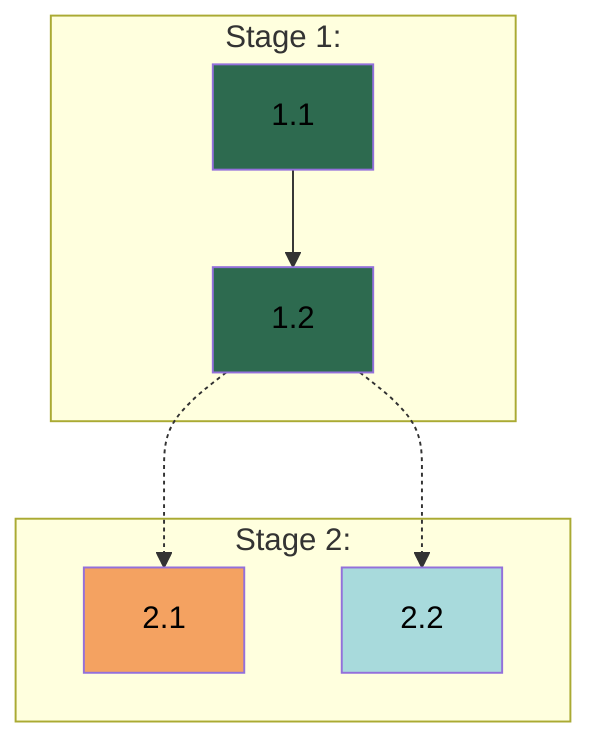

# APM 1.0.1 - 工作分解指南

## 1. 概述

**阅读本指南的 Agent：** Planner

本指南定义工作分解的流程——通过可见推理把收集到的上下文转化为规划文档（Spec、Plan 和 Rules）：在提交到文件前，先用聊天呈现分析供用户审阅。

### 1.1 产物

- *Spec：* 定义所构建之物的设计决策和约束。自由格式结构，由项目需要决定。
- *Plan：* 带 Worker 指派、验证标准、依赖链和 Dependency Graph 的 Stage 与 Task 分解。
- *`AGENTS.md`：* 任务执行期间应用的普适执行级 Rules。

上下文收集期间收集的所有上下文都必须捕获进这三份产物。若你从三份产物都省略了收集到的上下文，须说明为何执行不需要它——Manager 和 Worker 只依据这些文档操作。上下文如何映射到各文档由第 2.1 节工作流上下文规定。分解粒度适配项目规模和复杂度——小项目可更轻，大项目可能需要更多细节。

---

## 2. 执行规范

### 2.1 工作流上下文

从上下文收集的第 2.1 节工作流上下文可知，这些文档服务于不同读者，且 Manager 在运行时处理所有协调。Worker 不应意识到 Spec、Plan、Tracker 或 Index——他们只看到自己的 Task Prompt、Rules 和累计的执行上下文。内容只有经 Manager 提取进 Task Prompt 才能到达 Worker，所以你这里的放置决策决定了 Worker 最终拿着什么。本节把这种意识深化为你分解时做的放置决策。

**Spec 如何被使用：** Manager 读 Spec 并按任务提取相关内容进自包含 Task Prompt。设计决策应在 Manager 提取所需的层面——不是实现机制。

**Plan 如何被使用：** Manager 用 Plan 协调和构造 Task Prompt。任务指引提供 Manager 包装进 Task Prompt 的领域特化实质。任务指引共享 Spec 已捕获的设计决策时，引用相关 Spec 章节而非复述——Manager 读两份文档并在提取时把 Spec 内容整合进 Task Prompt。任务指引补充 Spec 未覆盖的（领域特化实现上下文、约束和模式）。Manager 在运行时用工作区上下文、已完成工作的发现和跨领域协调备注充实 Task Prompt。任务指引提供规划能确定的；Manager 补充只有运行时才能揭示的。

**Rules 如何被使用：** Rules 是 Worker 直接读的唯一规划期文档。因为 Worker 不应意识到 Spec 或 Plan，Rules 必须自包含。直接嵌入内容，不要按路径引用 Spec、Plan 或外部权威文档。

**协调是运行时的：** Manager 在运行时基于 Plan 结构决定工作如何派发——排序、并行执行、分组。Manager 在实现阶段确立版本控制约定。Plan 捕获工作结构；Manager 从中读取协调机会。

**给 Manager 传话：** 你有 Manager 应知晓但你无权行动处理的观察、用户偏好或上下文时，按第 4.1 节 Spec 格式和第 4.2 节 Plan 格式，把它作为文档头分隔线后的 blockquote notes 节。Spec notes 覆盖 Manager 会遇到的（版本控制观察、工作区约束、哪些代码库是活目标 vs 只读参考、影响执行的用户偏好）。Plan notes 覆盖你观察到的工作结构（为何存在某些边界、自然分组或排序模式在哪、关键路径长什么样、汇合在哪产生复杂度、哪些 Stage 边界上有价值的整体验证）。Notes 是给 Manager 的知情——观察和影响判断的推理，不是关于做什么的指令。

### 2.2 分解原则

这些原则适用于所有分解层级。粒度适配项目规模和复杂度。

**Domains：** 从上下文收集识别逻辑工作领域。领域涉及不同专长或心智模型时拆分。领域共享紧密上下文和依赖时合并。均衡时，倾向分离。整合用户偏好。

**Stages：** 顺序里程碑分组——Stage N+1 在 Stage N 完成后开始。每个 Stage 交付连贯价值。工作流不相关或中间交付物阻塞后续工作时拆分。分离显得人工时合并。均衡时，倾向更少 Stage 加清晰里程碑。领域能并行工作时，结构化为单个 Stage 内的并行 Tasks，而非并行 Stages。

**Tasks：** 从 Stage 目标派生。每个任务产一个有意义的交付物，限定在一个 Worker 的领域，带指定验证标准。任务跨领域或捆绑无关交付物时拆分。微任务徒增开销无价值时合并。调查或研究纳入 subagent 步骤。

**Steps：** 组织任务内工作以利于失败追踪。有序、离散、共享任务的验证。某步需独立验证时，拆分任务。

**范围边界：** Worker 可指派的工作在开发环境内可完成、可自主验证。用户协调涉及外部平台、凭证或需人工判断的验证——纳入明确协调步骤并注明用户参与的时机。

**验证标准：** 每个任务指定绑定其交付物的具体通过/失败标准——查什么、怎么查。Worker 能自主验证的标准（测试通过、产物存在且结构正确、行为符合需求）允许自主迭代。需用户参与的标准——判断（设计审批、内容质量）或操作（跑外部检查、确认平台行为）——要求 Worker 暂停。多数任务组合多种标准。验证标准是 Worker 范围域——不引用其他 Stage、Task 或协调层关卡。Worker 验证自己的交付物；超越单个任务的整体验证——里程碑检查、验收关卡、端到端验证——是 Manager 的运行时职责。上下文收集浮现出整体验证需求观察时，按第 2.1 节工作流上下文纳入 Plan notes——Manager 在运行时处理它们，不作为计划任务。

### 2.3 Spec 标准

Spec 定义所构建之物——界定交付物的设计决策、约束和需求。它构成 Plan 建立的基础：这里捕获的每个设计决策都在 Plan 有实现它的对应任务。

**内容放置：** Spec 捕获影响项目的决策——存在替代方案的、跨项目影响所构建之物的选择。单一范围细节归任务指引；普适执行模式归 Rules。某细节支持设计决策但不改变它时，细节放任务指引、决策留 Spec。

**来源文档：** 用户文档已权威定义需求时，引用而非复述——Spec 捕获叠加在已有需求上的设计决策。

**工作区结构：** 工作区含多个仓库或代码库时，在 Spec 捕获工作区结构——哪些仓库是工作目标、哪些是只读参考、Worker 在哪里操作。

**提取结构：** 按第 2.1 节工作流上下文构造以利提取——决策应可定位、可分离，让 Manager 能按任务提取相关内容进 Task Prompt。

### 2.4 Plan 标准

Plan 定义工作如何组织——Stages、Tasks、Worker 指派、依赖和验证标准。Manager 用它协调和追踪进度。

**内容放置：** 任务级内容——目标、交付物、Worker 指派、验证标准、依赖、逐步指引。跨任务的设计决策归 Spec；普适执行模式归 Rules。

**任务自足：** 每个任务必须含足够上下文，让 Worker 仅凭 Task Prompt 就能执行（按第 2.1 节工作流上下文）。

**指引和步骤：** 任务指引涉及 Spec 已捕获的设计决策时，引用 Spec 章节而非复述内容。Manager 读两份文档并在提取时把 Spec 内容整合进 Task Prompt——复述重复劳动且有分叉风险。指引补充 Spec 未覆盖的（领域特化实现上下文、约束和模式）。权威用户文档同理——按路径和章节引用。步骤描述 Worker 的顺序操作——Manager 把它们转化为整合了 Spec 内容和指引的可执行指令。

**派发友好构造：** Manager 以三种模式派发（single 任务、同 Worker 顺序任务组成 batch、发给不同 Worker 的 parallel 派发单元）。指派和任务顺序能多解时，倾向最大化派发机会的安排——能独立进行的任务、领域内自然成链的组、跨领域能并行的工作。Manager 在运行时基于 Plan 结构确定用哪种模式。

### 2.5 `AGENTS.md` 标准

`AGENTS.md` 定义工作如何执行——适用于全部或多数任务的执行模式。Worker 任务执行期间收到整个文件，不只是 APM Rules 区块。该区块是把 APM 管理的标准和既有内容分开的命名空间。

**内容放置：** Rules 捕获工作如何执行——不是构建什么。输出格式、响应字符串、数据 schema 和接口契约定义所构建之物，归 Spec，即使多个 Worker 需要它们。执行模式在适用于全部或多数任务时归这里——窄领域特化模式更宜放任务指引。不确定时，倾向任务指引——事后升格比降格容易。

**写作风格：** 所有 Worker 读同一份 Rules 文件。写规则时要让任何 Worker 都能判断某规则是否适用于其当前工作。规则按所执行的工作条件化表达，而非按特定 Worker 或领域——一个涉足多领域的 Worker 应能自然地对每项工作应用对的规则。

**既有内容：** `AGENTS.md` 已含用户标准时，从 APM Rules 区块引用相关既有规则而非复制。除非用户明确要求，不修改既有内容。

**自包含性：** Worker 的工作上下文被有意限定在 Task Prompt 和 `AGENTS.md`——Spec、Plan 和外部设计产物被有意省略。引用那些文档的标准会破坏这种限定。直接嵌入内容。

---

## 3. 工作分解流程

三份顺序文档（Spec、Plan、Rules），各自有分析、文件写入和用户批准关卡。完成一个并等用户批准后再开始下一个。每份文档遵循单遍流程：先在聊天可见地呈现分析，读目标产物文件，然后写。分析为用户组织推理，读过渡到写模式，写产出产物。

按 `.agents/skills/apm-communication/SKILL.md` 第 2.2 节可见推理，在聊天可见地呈现分析供用户审阅。每个批准关卡，说明写了什么、批准后接下来是什么、并请求审阅。

### 3.1 Spec 分析

在标题 **Spec Analysis:** 下呈现推理，覆盖以下方面。Spec 捕获所构建之物——不是工作如何分解。Workers、Stages 和 Task 结构在 Plan Analysis 确定。按第 2.3 节 Spec 标准执行以下动作。

1. 从收集的上下文分析设计决策：
   - *设计决策。* 每条明确选择和需求中嵌入的隐式约束：决定了什么、存在什么替代、为何这个方向。把陈述为事实、实则代表实际决策的假设揭示出来。
   - *来源文档：* 哪些需求在用户文档已有权威定义；引用而非复制。
   - *边界归属。* 对每个候选，按第 2.1 节工作流上下文确定其主位置：Spec（项目级设计决策）、Task guidance（任务范围细节、单一领域约束）或 Rules（普适执行模式）。每个条目归一个主位置。
   - *决策关系：* 级联、约束或自然聚类的决策。
   - *结构理由：* 如何按项目关切组织决策，让 Manager 能提取相关内容。
   - *Workspace。* 从上下文收集的工作区评估，记录项目环境：目录结构、工作仓库、参考仓库、权威文档位置、找到的既有 `AGENTS.md` 内容。
2. 读 `.apm/spec.md`，然后按第 4.1 节 Spec 格式写完整 Spec。`title` 设为项目名，`modified` 设为「Spec creation by the Planner.」，`## Overview` 填 3-5 句（项目类型、核心问题、核心范围、成功标准）。内容结构跟随识别出的决策。
3. 暂停求用户审阅：
   - 说明 Spec 已完成、产物已创建。
   - 请用户审阅准确性。
   - 需修改则应用并重复步骤 3。
   - 批准则进入第 3.2 节 Plan 分析。

### 3.2 Plan 分析

在标题 **Plan Analysis:** 下呈现推理，子标题为 **Domain Analysis:**、**Stage Structure:**、各 Stage 的 **Stage N:**、和 **Dependency Analysis:**。各节从前一节派生——领域影响 Stage 结构，Stage 目标分解为 Tasks。按第 2.4 节 Plan 标准执行以下动作。

1. 从收集的上下文和已批准 Spec 分析工作结构（按第 2.2 节分解原则）：
   - *Domain Analysis.* 立于上面已批准的 Spec：
     - 逻辑工作领域及其范围。
     - 领域为何分离或合并。
     - 领域如何映射到 Worker，含建议名称和责任。
     更新 Plan 头 Workers 字段。
   - *Stage Structure.* 从上面识别的领域出发，推理项目工作如何排序成 Stages。领域边界、依赖链或交付物里程碑在哪里创造自然进展点？每个 Stage 是顺序里程碑分组——Stage N+1 只在 Stage N 完成后开始。并行发生在 Stage 内（跨 Worker 的并行 Tasks），不跨 Stages。分析单个 Stage 前，呈现排序理由和每个 Stage 交付什么。更新 Plan 头 Stages 字段。
   - *Stage N.* 对每个 Stage：
     - *Stage 交付物和任务映射。* 该 Stage 达成里程碑需要哪些交付物。这些交付物如何映射到 Tasks：哪些足够区分以单独成任务、哪些紧密耦合以合并为一个、哪些能独立推进 vs 顺序推进。交付物跨领域时，拆成带跨 Agent 依赖的逐领域任务。交付物大时，拆成朝它推进的顺序任务。交付物共享紧密上下文或依赖时，合并以减少协调开销。呈现映射推理，然后命名浮现的任务——每个产出什么、为何各自作为独立工作单元存在。
     - *逐任务分析。* 对每个任务：
       - *Worker 指派：* 哪个 Worker、为何。
       - *任务范围：* 任务范围是什么？任何步骤涉及用户吗？
       - *任务指引：* Worker 需要的实现上下文，包括领域特化模式（如何组织代码、要遵循的既有模式）、约束（性能、安全、依赖）、技术决策（库选择、API 契约）、单一领域细节（验证方式、测试策略、错误处理细节）。纳入第 3.1 节 Spec 分析归类为 Task 范围的内容。对 Spec 已含设计决策，按第 2.4 节 Plan 标准引用 Spec 章节而非复述，按需补充领域特化上下文。
       - *任务验证：* 验证任务交付物的具体标准——查什么、怎么查。注明用户参与时机。验证标准与 Guidance 共同定义任务。
       - *依赖：* 同 Agent 写作 `Task N.M`，跨 Agent 写作 **`Task N.M by <Agent>`**（加粗），在边界指定交付物。
       - *步骤：* 朝任务完成推进的有序操作。
     每个任务方面都必须覆盖——深度随复杂度变化但覆盖面不变。步骤纳入指引。每个 Stage 后，按第 2.2 节分解原则评估每个任务是否代表可独立验证的工作。
   - *Dependency Analysis.* 所有 Stage 分析后，核实所有跨 Agent 依赖识别正确。交叉检查 agent 指派——依赖的生产者与消费者 agent 不同，就是跨 Agent 依赖。推理依赖审计（列举、分类、标出误分类）和跨 Agent 链（提供者、消费者、agent、所需交付物）。修正任何误分类依赖。按关系描述依赖——不是图的渲染属性。图格式在写步骤应用。
   - *写前检查。* 核实分析完整：每个任务所有方面已分析（Worker 指派、范围、指引、验证、依赖、步骤），工作量在 Worker 间合理分布，所有跨 Agent 依赖已识别，给 Manager 的 notes 已备好（按第 2.1 节）。纠正问题后再继续。
2. 读 `.apm/plan.md`，然后按第 4.2 节 Plan 格式写完整 Plan。`title` 设为项目名（与 Spec 同），`modified` 设为「Plan creation by the Planner.」。从推理充实任务细节。写时确保每个跨 Agent 依赖加粗。Plan 头包含 Dependency Graph。
3. 暂停求用户审阅：
   - 说明 Plan 已完成、产物已创建。向用户呈现摘要：Worker 数、Stage 数及名称和任务数、总任务数、派发模式。
   - 请用户审阅 Plan。
   - 需修改则应用并重复步骤 3。
   - 批准则进入第 3.3 节 Rules 分析。

### 3.3 Rules 分析

在标题 **Rules Analysis:** 下呈现推理，覆盖以下方面。

按第 2.5 节 `AGENTS.md` 标准执行以下动作：

1. 分析所有规划来源中的普适执行模式：
   - **来自 Spec：** 设计决策蕴含的执行模式，而非设计内容本身。设计决策定义的具体输出、格式、值和 schema 留在 Spec——它们经 Task Prompt 到达 Worker。
   - **来自 Plan：** 跨多个 Task guidance 字段复现的模式。
   - **来自收集的上下文：** 上下文收集的工作流偏好、约定或质量要求，尚未捕获进 Spec 或 Plan。版本控制约定排除——Manager 处理它们，并在实现阶段开始时把内容追加到 Rules。
   - **分类：** 按第 2.5 节 `AGENTS.md` 标准，把适用于全部或多数任务的模式与窄领域特化模式分开。多数项目产生很少真普适规则——项目特化约束和输出规范归 Spec 或 Task guidance，即使适用于多个 Worker。
   - **既有标准：** `AGENTS.md` 已含什么；引用而非复制。
2. 读 `AGENTS.md`（或确认不存在），然后按第 4.3 节 APM_RULES 区块写：
   - 文件存在：保留区块外内容，追加 APM_RULES 区块。
   - 新建：只创建含 APM_RULES 区块的文件。
3. 暂停求用户审阅：
   - 说明 Rules 已完成。
   - 请用户审阅 `AGENTS.md` 的准确性。
   - 需修改则应用并重复步骤 3。
   - 批准则说明工作分解完成、所有规划文档已创建。继续 `.agents/skills/apm-1-initiate-planner/SKILL.md` 第 4 节规划阶段完成。

---

## 4. 结构规范

### 4.1 Spec 格式

**位置：** `.apm/spec.md`

**YAML Frontmatter Schema:**

```yaml
---
title: <project name>
modified: <last modification note>
---
```

Frontmatter 下，文档以 `# APM Spec` 开头，后接两个头节：`## Overview`（3-5 句，覆盖项目类型、核心问题、核心范围和成功标准）和 `## Workspace`（工作区评估的项目环境：目录结构、工作仓库、参考仓库、权威文档位置、既有 `AGENTS.md` 内容）。单个水平分隔线把头和下方的设计决策内容分开。内容节内不用水平分隔线——`##` 标题已提供足够视觉分隔。

- *Planner notes：* 紧接水平分隔线之后、内容节之前。用格式 `> **Notes:** <散文或无序列表>`。这些覆盖 Manager 会遇到的（按第 2.1 节工作流上下文）——版本控制观察、工作区约束、影响执行的用户偏好。

**内容结构：** 头下方自由格式。组织成反映项目自然结构的节——其领域、组件、边界或技术关切。相关设计决策共享一节；横切选择各自成节。Spec 应读起来像对构建什么及为何的连贯描述，由项目独特需求决定。

**内容规则：** 用 Markdown 标题（`##`）组织决策组。每条规格必须具体可行动。构造以利提取——Manager 把相关内容蒸馏进单个 Task Prompt，所以决策应可定位、可分离。引用既有用户文档而非复制——含文件路径和具体章节，让 Manager 在任务派发时能定位来源材料。枚举值用表格、关系用 mermaid 图、schema 用代码块、理由用散文。

### 4.2 Plan 格式

**位置：** `.apm/plan.md`

**YAML Frontmatter Schema:**

```yaml
---
title: <project name>
modified: <last modification note>
---
```

Frontmatter 下，文档以 `# APM Plan` 开头，后接 Plan 头：`## Workers`（表 `| Worker | Domain | Description |`）、`## Stages`（表 `| Stage | Name | Tasks | Agents |`）、`## Dependency Graph`（按下方 Dependency Graph Format 的 mermaid 图）。单个水平分隔线把头与下方 Stage 节分开。Plan 中无其他水平分隔线——`##` 和 `###` 标题已提供 Stage 与 Task 间的足够视觉分隔。

- *Planner notes：* 紧接水平分隔线之后、Stage 节之前。用格式 `> **Notes:** <散文或无序列表>`。这些覆盖你对工作结构观察到的东西（按第 2.1 节工作流上下文）——为何存在边界、自然分组或排序模式、关键路径、汇合点、以及整体验证可能有价值的 Stage 边界。

**Stage 格式。** Plan 中每个 Stage：

- *Header:* `## Stage N: [Name]`
- *Naming:* Stage 名反映领域、目标和主要交付物。
- *Contents:* 按 Task Format 的任务，每个含按 Step Format 的步骤。

**Task 格式。** Plan 中每个任务：

*Header:* `### Task <N>.<M>: <Title> - <Domain> Agent`

*Contents:*

```markdown
* **Objective:** [Single-sentence Task goal.]
* **Output:** [Concrete deliverables - files, components, artifacts produced.]
* **Validation:** [Concrete pass/fail criteria. Note where User involvement is needed.]
* **Guidance:** [Technical constraints, approach specifications, references to existing patterns, User collaboration patterns.]
* **Dependencies:** [Prior Task outputs required. Use `Task N.M by <Domain> Agent, ...` format. Bold cross-agent dependencies. Use "None" when no dependencies exist.]

1. [Step description]
2. [Step description]
```

**Step 格式：** 每个步骤是描述离散操作的编号指令。步骤是顺序操作；Guidance 是告知操作如何执行的情境和约束。分开——步骤隐式引用 Guidance，而非嵌入它。含 Worker 能直接执行的清晰具体指令。相关时引用模式、文件或先前工作。需调查、探索或研究时，含一个描述目的和范围的 subagent 步骤（如「派发 debugging subagent 隔离渲染问题」或「派发 research subagent 核实当前 API 认证模式」）。

**Dependency Graph 格式：** Dependency Graph 是 Plan 头中的 mermaid 图，可视化任务依赖、agent 指派和执行流。它让 Manager 识别 batch 候选、并行派发机会、关键路径瓶颈和协调点。

*图结构：*



该图让派发模式对 Manager 可见：同 Agent 链表示 batch 候选，独立跨 Agent 节点表示并行候选，虚线边标记一个 Worker 的产出输入另一 Worker 的跨 Agent 协调点。

*节点格式：* `T<Stage>_<Task>["<Task ID> <Title><br/><i><Agent Name></i>"]`

*边规则。* 同 Agent 依赖用 `-->`（实线）。跨 Agent 依赖用 `-.->`（虚线）。只画直接依赖——不画传递闭包。

*样式：* 每个 agent 在所有其任务节点上分配一致填充色。所有 subgraph 后，用 `style T<S>_<T> fill:<color>` 语句应用颜色，按 Worker 在 Plan Workers 字段的出现顺序。文字颜色用 #000，选择有足够对比度的填充色以保证可读。

### 4.3 APM_RULES 区块

`AGENTS.md` 的命名空间区块结构：

```text
APM_RULES {

[Project-specific standards below]

} //APM_RULES
```

**内容规则：** 除非明确要求，APM_RULES 区块外不写内容。类别用 Markdown 标题（`##`）。每条标准必须具体可行动。只写普适执行级模式——不是架构决策、任务特化指引或协调决策。引用区块外既有标准而非复制。

---

## 5. 常见错误

- *规格不足：* 设计决策留隐式——若某点合理上能多解，就把选定方向写下来。
- *Spec 吸收分解：* Spec 捕获工作如何分解（Worker 指派、Task 结构、Stage 排序）而非构建什么。Workers、Stages 和 Task 结构是 Plan 关切——Spec 停在设计决策层面。
- *验证当后补：* 「能正常工作」不是标准。每个任务需要具体衡量——查什么、怎么查、通过/失败边界在哪。含糊标准产出含糊验证。
- *依赖误分类：* 跨 Agent 依赖未加粗、同 Agent 依赖错误加粗、或 Dependency Graph 边类型错——写时按生产者与消费者是否同一 agent 来分类。
- *跳过批准关卡：* 每份文档有自己的分析-写-批准循环。用户逐份审阅并批准后下一份才开始。不停顿产出多份文档、或未获用户批准就进下一份，都会破坏循环。
- *在任务指引里复述 Spec 内容：* 任务指引重复 Spec 已有设计决策时，你与 Manager 维护了可能分叉的冗余内容。在任务指引引用 Spec 章节——Manager 读两份文档并在提取时把 Spec 内容整合进 Task Prompt。
- *Rules 引用协调层文档：* Worker 不应意识到 Spec、Plan、Tracker 或 Index。说「按 Spec」或「如 Plan 定义」的规则，引用了 Worker 从未读过的文档。直接嵌入内容。
- *Notes 放错位置：* 工作结构观察（并行性、派发模式、分解理由）归 Plan notes，不归 Spec notes。项目环境观察（工作区约束、版本控制模式）归 Spec notes，不归 Plan notes。
- *Notes 当指令：* Notes 是给 Manager 的知情，不是其行动。是关于存在什么及为何的观察，不是关于做什么的指令。
- *分析呈现为预先决定：* 聊天中的可见推理必须展示结论如何得出，而非呈现为已决定。内部推理或思考可先得出结论，但可见分析仍须向用户逐步走一遍推理。
- *任务无派生呈现：* 每个 Stage 的 Tasks 必须从交付物可见派生——哪些交付物映射到哪些任务及为何。只列任务不推理，会阻止用户审计分解决策。

---

**指南结束**
